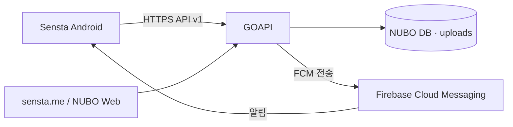

# SENSTA Android

[sensta.me](https://sensta.me)를 위한 사진 중심 Android 네이티브 앱입니다. Sensta 2.0은 한 화면을
가득 채우는 세로 피드, 작품 탐색, 사진가 프로필과 1:1 대화를 하나의 흐름으로 연결합니다. 로그인하지
않아도 공개 작품을 감상할 수 있으며, 계정으로 사진을 공유하고 다른 사진가와 교류할 수 있습니다.

현재 개발 버전은 **2.1.3**(`versionCode 26`)이며 Android 8(API 26) 이상을 지원합니다. Android 17
SDK(API 37)로 컴파일하고 Google Play 대상 API는 Android 16(API 36)입니다.

## Sensta 2.1

- 전체 화면 preview 이미지와 세로 스냅 스크롤로 구성한 몰입형 홈 피드
- 피드 위치를 유지하는 작품 상세 이동과 좌우를 가득 채우는 다중 이미지 캐러셀
- 사진을 빠르게 훑어보는 탐색 그리드
- 최근 작품 헤더, 접히는 프로필, 사진·메시지 탭으로 구성한 다른 사진가 페이지
- 프로필의 작품·사진·좋아요 요약과 작품별 성과·정렬을 보여주는 내 작품 스튜디오
- 새 업적 획득 축하 화면과 `작품·정보·업적` 탭으로 구성한 프로필 업적 진열장
- Google·이메일 로그인, 세션 복원과 안전한 refresh token 회전
- 최대 9장·합계 100MB 사진 업로드, 태그와 EXIF 표시
- 원본·4:5·3:4 자르기, 회전·반전과 강도 조절식 6종 사진 필터
- 게시글·댓글 좋아요, 댓글, 1:1 대화와 Firebase 실시간 알림
- 신고·차단·차단 해제, 앱 안의 계정 및 관련 데이터 삭제
- Sensta의 따뜻한 색상 체계와 시스템 밝은·어두운 테마

## 시스템 구성

Sensta Android는 독립된 데이터베이스를 두지 않습니다. NUBO가 웹과 운영 환경을 제공하고, NUBO에
포함된 GOAPI가 앱의 API v1 계약을 처리합니다. Firebase는 알림 전송에만 사용합니다.



| 모듈 | 책임 |
| --- | --- |
| `app` | Jetpack Compose 화면, 내비게이션, ViewModel, 업로드와 알림 처리 |
| `domain` | 화면과 서버 구현에 독립적인 모델, repository 계약, use case |
| `data` | Retrofit API, DTO 변환, 인증 저장소와 repository 구현 |

주요 기술은 Kotlin, Jetpack Compose·Material 3, Hilt·KSP, Retrofit·OkHttp,
Kotlin Serialization, Room·DataStore, WorkManager, Coil과 Firebase Cloud Messaging입니다.

## 빠른 시작

### Android Studio

1. 저장소를 clone하고 Android Studio 최신 안정 버전에서 프로젝트 루트를 엽니다.
2. Gradle JDK를 Android Studio에 포함된 JDK 17 이상으로 지정합니다.
3. SDK Manager에서 Android SDK 37과 Build Tools 37을 설치합니다.
4. `app` 실행 구성을 선택하고 에뮬레이터나 USB 디버깅을 허용한 기기에서 실행합니다.

debug 앱의 패키지는 `me.sensta.debug`이므로 Play 앱 `me.sensta`와 함께 설치할 수 있습니다. 기본
API 주소가 실제 `https://sensta.me`이므로 테스트 게시물과 계정도 운영 데이터로 취급해야 합니다.

### WSL2 / Linux

프로젝트 스크립트가 사용자 홈에 Temurin JDK 17과 Android SDK를 준비합니다.

```bash
./scripts/bootstrap-wsl.sh
source ./scripts/android-env.sh
./gradlew :app:assembleDebug
```

전체 품질 게이트는 다음 명령으로 실행합니다.

```bash
./scripts/check.sh
```

이 명령은 단위 테스트, Android Lint, debug·release APK와 release App Bundle을 순서대로 검증합니다.

## 설정

서비스 주소, 사진 게시판과 업로드 제한의 기본값은
[`data/src/main/java/me/data/env/Env.kt`](data/src/main/java/me/data/env/Env.kt)에 있습니다. 앱 이름,
아이콘, 로고와 색상은 `app/src/main/res`에서 관리합니다.

### Google 로그인과 Firebase

Firebase Console의 같은 프로젝트에 다음 Android 앱을 각각 등록합니다.

- `me.sensta`: Google Play 출시 앱
- `me.sensta.debug`: 개발·실기기 테스트 앱

두 패키지가 포함된 `google-services.json`을 `app/google-services.json`에 둡니다. 이 파일은 Git에서
제외되며, 없을 때도 앱은 빌드되고 알림은 WorkManager 주기 조회 방식으로 대체됩니다. Google 로그인의
서버 client ID는 웹과 Android의 토큰 검증을 담당하는 동일한 Google Cloud 프로젝트에서 관리해야 합니다.

서버용 `firebase-service-account.json`은 Android 프로젝트나 휴대전화에 넣지 않습니다. 운영 서버의
`/etc/nubo`처럼 웹에서 공개되지 않는 경로에만 보관하고 GOAPI 환경변수로 연결합니다. 전체 절차는
[Firebase 설정](docs/FIREBASE_SETUP.md)을 참고하세요.

## 빌드와 실제 기기 테스트

```bash
# debug APK
./gradlew :app:assembleDebug

# 연결 기기 확인 및 설치
adb devices
adb -d install -r app/build/outputs/apk/debug/app-debug.apk
```

Android 실제 기기에서는 로그인·세션 복원, JPEG/HEIF 다중 업로드, EXIF, 댓글·좋아요, 1:1 대화,
포그라운드·백그라운드 알림, 신고·차단과 계정 삭제까지 확인합니다. 테스트 데이터의 준비부터 로그 수집,
debug 앱 제거 방법은 [Android 실제 기기 테스트](docs/DEVICE_TESTING.md)에 정리되어 있습니다.

## 배포와 Google Play 재출시

출시는 Android 앱만 올리는 작업이 아닙니다. 앱과 같은 API 계약을 제공하는 NUBO·GOAPI가 먼저 운영
서버에 배포되어야 합니다.

1. 운영 DB와 uploads를 외부 저장소에 백업합니다.
2. [운영 서버 배포](docs/SERVER_DEPLOYMENT.md)에 따라 NUBO 통합 릴리스를 적용하고 readiness와 버전을 확인합니다.
3. Android 실제 기기에서 핵심 사용자 여정과 Firebase 알림을 회귀 테스트합니다.
4. 기존 Play 업로드 키로 서명한 release AAB를 만들고 서명을 검증합니다.
5. Play 내부 테스트에서 Data safety, 계정 삭제, UGC 정책과 스토어 자산을 확인한 뒤 단계적으로 출시합니다.

업로드 키와 비밀번호는 저장소에 저장하지 않고 `~/.gradle/gradle.properties` 또는 같은 이름의
환경변수로만 제공합니다.

```properties
SENSTA_STORE_FILE=/absolute/path/sensta-upload.jks
SENSTA_STORE_PASSWORD=store-password
SENSTA_KEY_ALIAS=upload-key-alias
SENSTA_KEY_PASSWORD=key-password
```

```bash
./scripts/check.sh
source ./scripts/android-env.sh
$ANDROID_HOME/build-tools/37.0.0/apksigner verify --verbose \
  app/build/outputs/apk/release/app-release.apk
$JAVA_HOME/bin/jarsigner -verify \
  app/build/outputs/bundle/release/app-release.aab
```

최종 AAB는 `app/build/outputs/bundle/release/app-release.aab`에 생성됩니다. 기존 Play 앱의 최신
`versionCode`가 20 이상이면 반드시 더 큰 값으로 올린 뒤 다시 빌드해야 합니다. 정책과 제출 항목은
[Google Play 재출시 안내](docs/PLAY_RELEASE.md)를 따릅니다.

## 다른 NUBO 커뮤니티에 적용하기

이 저장소는 NUBO를 사용하는 웹사이트에서 Sensta와 같은 커뮤니티 전용 Android 앱을 개발하는 방법을
보여주는 참고 구현입니다. Sensta 앱을 거의 그대로 복제해 이름과 서버 주소만 바꿔 출시하기보다는,
각 커뮤니티의 목적과 이용자 경험에 맞는 화면 구성·기능·브랜드를 설계해 고유한 앱으로 발전시키는 것을
권장합니다. 참고하여 개발할 때는 적어도 다음 항목을 서비스에 맞게 바꿉니다.

| 항목 | 변경 위치 |
| --- | --- |
| 도메인·게시판·업로드 제한 | `data/src/main/java/me/data/env/Env.kt` |
| 앱 이름·색상·로고·아이콘 | `app/src/main/res` |
| 패키지·버전·서명 | `app/build.gradle.kts` |
| Firebase Android 설정 | `app/google-services.json` |

서버는 최신 [NUBO](https://github.com/sirini/nubo)와 [GOAPI](https://github.com/sirini/goapi)의 API v1
계약을 제공해야 합니다. 인증, 신고·차단·탈퇴, FCM 기기 등록과 채팅 계약을 생략하면 관련 앱 기능은
동작하지 않습니다.

## 문서

| 문서 | 내용 |
| --- | --- |
| [프로젝트 상태](docs/PROJECT_STATUS.md) | 2.0 결정, 완료 작업과 남은 출시 작업 |
| [2.0 로드맵](docs/SENSTA_2_ROADMAP.md) | 단계별 개발 목표와 범위 |
| [Firebase 설정](docs/FIREBASE_SETUP.md) | Android 앱 등록, FCM과 GOAPI 서비스 계정 |
| [실제 기기 테스트](docs/DEVICE_TESTING.md) | Android 기기 연결, 설치, 업로드와 회귀 시나리오 |
| [운영 서버 배포](docs/SERVER_DEPLOYMENT.md) | NUBO·GOAPI 업데이트와 배포 후 점검 |
| [Play 재출시](docs/PLAY_RELEASE.md) | 업로드 서명, 정책, 스토어 제출 순서 |

## 관련 프로젝트

- 웹사이트: [sensta.me](https://sensta.me)
- Android: [github.com/sirini/sensta](https://github.com/sirini/sensta)
- NUBO: [github.com/sirini/nubo](https://github.com/sirini/nubo)
- GOAPI: [github.com/sirini/goapi](https://github.com/sirini/goapi)

## 라이선스

[MIT License](LICENSE). Sensta 서비스는 비상업적으로 운영하며 사진을 좋아하는 모든 분에게 열려 있습니다.
